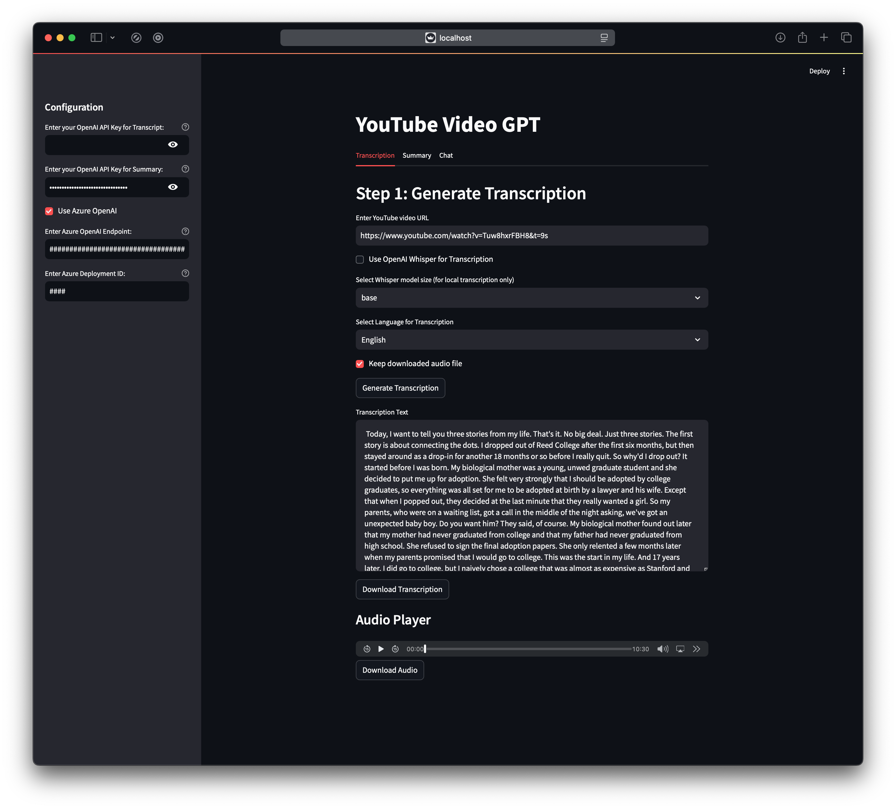
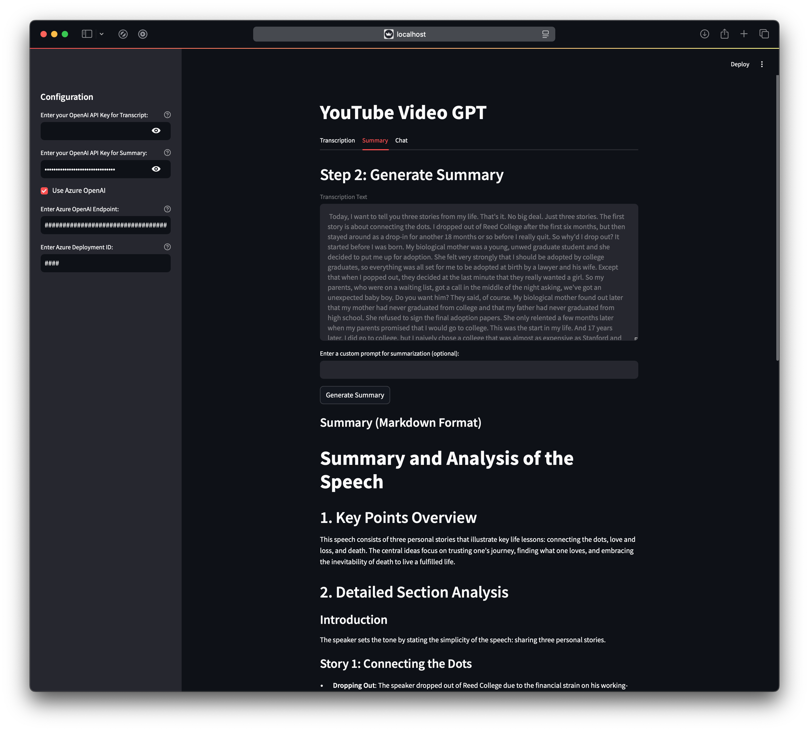
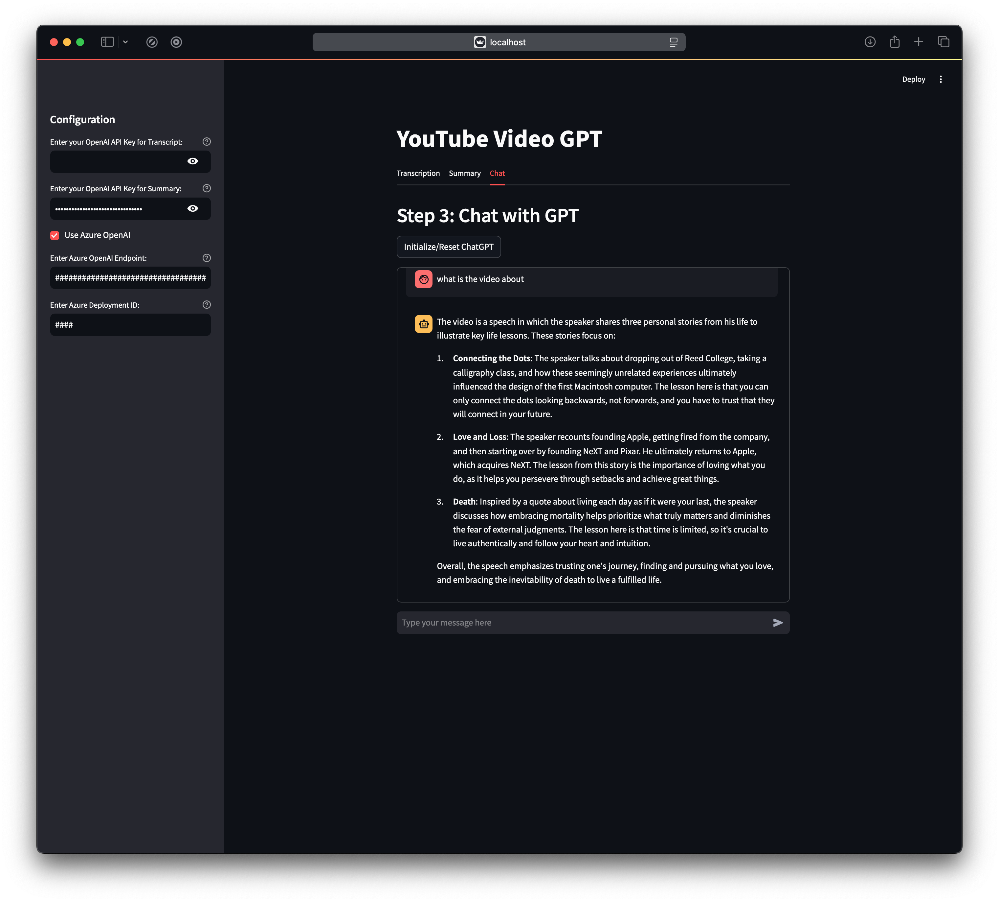

# **YouTube Video GPT**

This tool simplifies the process of transcribing YouTube videos and generating structured summaries using OpenAI's GPT models. It offers a user-friendly interface for seamless transcription, summarization, and chat-based interactions, making it an efficient solution for content analysis and understanding.


## **Prerequisites**

Before starting, ensure you have the following installed on your system:

- Python 3.11 or above
- `rye` for package management
- A valid OpenAI/Azure OpenAI API key


### **Project Setup**

1. **Clone the Repository**
    
    Clone this project to your local machine:
    
    ```bash
    git clone https://github.com/yh00722/youtube-video-gpt.git
    cd youtube-video-gpt
    ```
    
2. **Install Dependencies and Set Up the Virtual Environment**
    
    Using `rye`:
    
    ```bash
    rye sync
    source .venv/bin/activate
    ```


## **Usage**

### **Start the Streamlit Application**

To run the transcription and summary tool:

```bash
streamlit run src/app.py
```

This will launch the Streamlit web application in your default browser.


### **Step1: Generate Transcription**

1. **Navigate to the Transcription Tab**
    
    Select the "Transcription" tab to start transcribing a YouTube video.
    
2. **Enter YouTube Video URL**
    
    Input the YouTube video URL in the provided text box.
    
3. **Select Transcription Settings**
    - **Whisper Model**: Choose a Whisper model size from options like `tiny`, `base`, `small`, `medium`, and `large`.
    - **Language Selection**: Either select a specific language for transcription or leave it as "None (Auto-detect)" for automatic language detection.
    - **Save Audio File**: Check the "Keep downloaded audio file" box if you want to save the audio file for later use.
4. **Generate Transcription**
    
    Click the **Generate Transcription** button to start the transcription process. Once completed, the transcription text will appear in a text area below.
    
5. **Download Options**
    - You can download the transcription as a text file using the **Download Transcription** button.
    - An **Audio Player** will also appear if the audio file is saved, with an option to **Download Audio**.


- 

### **Step2: Generate Summary**

1. **Navigate to the Summary Tab**
    
    Switch to the "Summary" tab to summarize the transcription text.
    
2. **Review the Transcription Text**
    
    The transcription text generated in Step 1 will be displayed in a read-only text box.
    
3. **Enter a Custom Prompt (Optional)**
    
    Optionally, input a custom prompt for summarization in the provided text box to tailor the summary.
    
4. **Generate Summary**
    
    Click the **Generate Summary** button. The tool will process the transcription and display a structured summary in Markdown format.
    
5. **Download Summary**
    
    Save the summary as a Markdown file by clicking the **Download Summary** button below.
- 

### **Step 3: Chat with GPT**

1. **Navigate to the Chat Tab**
    
    Select the "Chat" tab to interact with GPT.
    
2. **Initialize ChatGPT**
    
    Click the **Initialize/Reset ChatGPT** button to prepare the chatbot for interaction.
    
3. **Start Chatting**

    Enter your message in the chat input box at the bottom.

- 